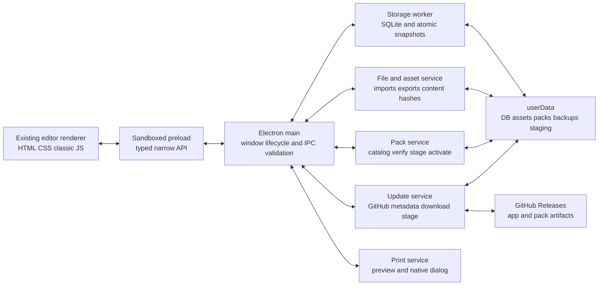

# Set Conjurer Electron Desktop Application

## Planning metadata

- Status: ready for human review; implementation has not started.
- Planning branch: `feat/electron-desktop-app`
- Planning worktree: `/Users/josephlawlor/Developer/.codex-worktrees/card-conjurer-electron-desktop-app`
- Base branch: `origin/master`
- Base commit: `9dbb785ca2279d9a3deab98ba0ec55dc5ac4ae97` (`Refine card editor workspace UI and interactions`)
- Planning date: 2026-08-03
- Product name: **Set Conjurer**
- Publisher metadata: **Jake Lawlor**
- Version-one platforms: macOS arm64, macOS x64, and Windows x64. Linux is deferred.
- Distribution: signed GitHub Release installers only; no hosted application, app store, accounts, cloud storage, or telemetry.

## Structured brief

### Desired outcome

Turn the current local static Card Conjurer fork into a polished, downloadable desktop application without replacing its established editor UI or canvas renderer. Set Conjurer should feel like the same application the user has been refining at `localhost:8081`, but it should own its data, frame packs, file imports and exports, printing, updates, and operating-system integration.

A first-time user downloads a signed installer from GitHub, opens Set Conjurer, sees a short Card Conjurer attribution, and completes a compact onboarding flow. The Standard frame pack is selected and required. The user may also select Booster Fun, Tokens, Basics, Legacy, and Custom. The application downloads and verifies those packs with visible progress before opening the editor. Thereafter the editor and installed assets work offline.

Sets, cards, undo history, preferences, user-uploaded art, symbols, watermarks, and card-specific custom frame images live in the application's standard local data directory. Users choose a filesystem location only when explicitly importing or exporting. There are no accounts and no server-side user data.

Application and installed-pack updates are discovered automatically but never downloaded without a click. A single **Update Now** control downloads every applicable update and displays combined determinate progress as a clockwise circular indicator. When staging is complete, the same control becomes **Restart Now**. Restarting activates the update, with a recoverable pre-update snapshot and rollback on activation or migration failure.

Set and card printing use a new same-window preview tailored to real cards: fixed 2.5 by 3.5 inch cards, eight cards in a 2-by-4 landscape grid, US Letter and A4, perimeter trim ticks, per-card quantities, and optional duplex card backs. The existing legacy print route is replaced.

### Success criteria

- Signed macOS arm64, macOS x64, and Windows x64 installers are attached to stable and beta GitHub Releases and launch without bypass instructions on supported systems.
- macOS artifacts are hardened, Developer ID signed, and notarized. Windows executables and installers carry a trusted code signature.
- The packaged application contains the editor and new print screen only, not the legacy website navigation, gallery, converter, tutorial, account, or donation surfaces.
- The visual editor remains recognizably identical to the current three-column Set Editor. Packaging does not introduce a framework rewrite.
- The renderer has no Node.js access. Context isolation and sandboxing are enabled; privileged work is available only through a typed, validated preload API.
- No application page can navigate to arbitrary content, create arbitrary windows, execute downloaded code, or read arbitrary paths through an IPC message.
- The base installer excludes the multi-gigabyte frame library. Onboarding requires the Standard pack and offers the five optional parent packs.
- A pack installs all definitions, variants, components, and declared dependencies beneath that parent. Pack archives are immutable, content-verified, and contain data/assets rather than remotely executable JavaScript.
- Installed frame packs work offline. Missing network access affects onboarding downloads, Scryfall lookups, issue reporting, and update checks with clear retryable states rather than damaging local work.
- A frame added to an existing optional pack can ship independently of an application release when it uses an already trusted renderer. Frames requiring new renderer logic declare a minimum app version and ship with an app update first.
- Removing an installed pack warns when cards depend on it, includes the affected-card count, and may proceed. Those cards remain stored and visibly missing their required pack; the renderer never silently substitutes another frame.
- Importing a portable card or set identifies exact missing pack versions, offers one-click downloads, and renders identically after those immutable versions are present.
- Official pack assets are referenced by immutable pack/version IDs in saved data and are not duplicated in portable files. User-provided assets are embedded in portable files.
- Existing `.cardconjurer-card` and `.cardconjurer-set` extensions continue to work through buttons, drag/drop, Finder/Explorer open-with, and cold-start file association paths.
- Existing schema-version-one files remain importable. Files from unsupported future schemas fail closed with a useful error.
- Local set/card autosave, persistent undo/redo, set switching, imports, and exports retain their current behavior after the desktop storage adapter replaces direct IndexedDB ownership.
- Before any app/schema update activation, Set Conjurer creates one recoverable snapshot. Successful activation removes or rotates it; failed activation restores it. No recurring backup system is added.
- **Manage Frame Packs** and **Settings** use the current left-drawer visual language. Settings initially contains Check for Updates and Stable/Beta channel selection.
- The app has no telemetry or automatic crash submission. **Report Issue** opens the repository issue form with app version, OS, architecture, and installed pack versions prefilled, but no card content or user data.
- Set Options includes **Print Set** and Export Card includes **Print Card**. Both open the new same-window print preview and return to the editor without losing state.
- Printing uses exact physical card dimensions with no user scaling option, Letter/A4 landscape selection, locale-appropriate default, 2-by-4 placement, boundary-aligned perimeter ticks, collector-number set order, and saved per-card quantities.
- The print model supports Standard Card Back (default) and No Back. Its schema and imposition engine can later use a card-specific back face without redesign.
- Stable is the default release channel. Beta users receive beta and subsequent stable releases; changing back to Stable changes future update eligibility and clearly explains when a newer stable build does not yet exist.
- The application is single-window and single-instance. A second launch or associated-file open focuses the existing window and queues the import safely.
- The original Card Conjurer creator, Kyle Burton, and existing contributors remain credited. A short first-run acknowledgment is accompanied by full attribution, repository, and dependency notices in About Set Conjurer.

## Scope

### In scope

- Electron Forge project scaffolding and a TypeScript main/preload/service boundary around the existing classic-JavaScript renderer.
- Secure custom application and asset protocols, strict navigation controls, CSP hardening, removal of runtime CDN dependencies, and conversion of inline event bindings required by CSP.
- Local desktop persistence, user-asset storage, schema migrations, pre-update snapshots, and browser-development fallback behavior.
- Declarative frame-pack compilation, catalogs, installation, dependency/version resolution, missing-pack UX, safe removal, and independent pack releases.
- First-run onboarding, Manage Frame Packs, Settings, About Set Conjurer, update-status controls, and Report Issue.
- Stable/beta application releases, unified app/pack update staging, determinate progress, restart activation, and rollback.
- GitHub Actions test/build/sign/notarize/publish pipelines for macOS arm64/x64 and Windows x64.
- Existing portable-file evolution, operating-system file associations, drag/drop, and deep launch handling.
- A complete replacement of the legacy print screen and its data architecture.
- A distinct SC app icon derived from the repository's rounded Card Conjurer mark, using Set Conjurer's blue palette.
- Automated logic, storage, security, update, packaging, import, and print tests plus targeted physical acceptance testing.
- Removal/replacement of the current S3 website publication workflow. This plan does not delete or mutate any existing cloud bucket.

### Explicit non-goals

- A hosted web version, online accounts, cloud synchronization, collaborative editing, remote user storage, telemetry, or automatic crash uploads.
- Linux packages or Linux update support in version one.
- Mac App Store, Microsoft Store, or another app-store distribution path.
- A framework rewrite of the renderer, canvas, frame compositor, text engine, or current UI.
- Importing the current localhost IndexedDB database. Existing portable files are the migration path.
- Recurring backups, cloud backups, or general-purpose backup management.
- A persistent user-frame library in version one. The existing per-card Custom Frame Images flow remains. The pack/storage contracts must leave room for a future local User Frames library.
- Executing community or downloaded JavaScript as a frame pack.
- A true double-faced card editor. Only storage and printing seams for a future `backFace` are included.
- Print scaling, arbitrary paper sizes, portrait imposition, bleed controls, interior cut boxes, or more back choices than Standard Card Back and No Back.
- Creating a new GitHub repository or website.
- Legal or asset-licensing review. The repository currently has no root `LICENSE` file; licensing is an explicitly deferred owner/release concern, not an engineering task in this plan.
- Merging, publishing, or releasing as part of implementation without separate release approval.

## Decisions made

| Area | Decision |
| --- | --- |
| Product | Rename the desktop product to Set Conjurer while keeping explicit Card Conjurer fork attribution. |
| Application identity | Use stable app ID `com.lawlordev.setconjurer`, product/executable name `Set Conjurer`, and publisher/manufacturer `Jake Lawlor`. Treat the app ID as permanent because changing it breaks OS identity, data paths, and updates. |
| Repository | Continue in the existing `lawlordev/cardconjurer` repository. |
| Renderer | Preserve the existing HTML/CSS/classic-JavaScript editor and canvas renderer; add a desktop adapter rather than porting to React or another UI stack. |
| Desktop stack | Electron Forge, TypeScript for privileged code, npm lockfile, ASAR packaging, and Electron fuses. |
| Electron baseline | Start implementation on the latest Electron 43 patch (43.2.0 at planning time). Electron 43 supports macOS 12; Electron 44 raises the floor to macOS 13, so that major upgrade requires an explicit compatibility decision. Windows support begins at Windows 10. |
| Architectures | Separate macOS arm64 and x64 artifacts; Windows x64 only. Intel macOS is CI/package validated and remains best-effort until a tester is available. |
| Installer | DMG for macOS; Squirrel Setup executable for Windows. Update assets also include the Squirrel.Mac ZIP and Windows RELEASES/NUPKG files. |
| Local data | Use `app.getPath('userData')` with an application-owned directory layout. Do not ask users to select an app-data folder. Keep Chromium `sessionData` in a separate cache path. |
| Database | Use Electron's pinned Node 24 `node:sqlite` in a dedicated worker thread. The worker owns transactions so the synchronous SQLite API never blocks the Electron main/UI thread. Keep a narrow storage adapter so SQLite can be replaced without touching editor logic if the release-candidate API changes. |
| User assets | Store validated content-addressed files outside JSON rows; reference them by hash/asset ID. Deduplicate uploads and embed them in portable exports. |
| Packs | Six parent IDs: `standard`, `booster-fun`, `tokens`, `basics`, `legacy`, and `custom`. Standard is required. “Custom” is the existing catalog category, not the future user-created frame library. |
| Pack safety | Downloaded packs are declarative manifests/definitions/assets only. Specialized executable renderer code is bundled and trusted with the app and selected through allowlisted renderer IDs. |
| Pack identity | Saved cards reference `packId`, exact `packVersion`, stable `frameDefinitionId`, and definition version. Old pack archives remain available so shared files can reproduce the sender's rendering. |
| Updating | Metadata checks may be automatic; bytes never download until Update Now. App and installed-pack updates stage together and activate on Restart Now. |
| Release channels | Stable by default; beta is opt-in in Settings. SemVer prereleases use `-beta.N`. Frame-pack catalog releases use a separate tag namespace and never become GitHub's “latest” application release. |
| Printing | Same-window preview, native OS dialog, fixed 2.5 × 3.5 inch cards, landscape Letter/A4, 4 columns by 2 rows (eight portrait cards on a sideways sheet), perimeter ticks, short-edge duplex model, saved quantities. |
| Network | Permit only explicit HTTPS services required by product flows. Remove generic CORS proxies and runtime script CDNs from the packaged app. Validate external URLs before opening them in the system browser. |
| Testing | Existing `node:test` suite remains. Add TypeScript/unit tests and Playwright Electron development-build tests; use manual/native smoke checks for signed packaged artifacts because Playwright's Electron bridge conflicts with hardened fuse settings. |

## Current-state findings

### Repository and application shape

- The repository is a static site: HTML, CSS, classic scripts, a Python local server, and no `package.json`.
- The current editor entry is `creator/index.html`. It contains the polished three-column Set Editor the desktop app should preserve.
- The root `index.html` and HTMX shell own legacy website navigation. Electron should load a dedicated packaged editor entry and should not package the website routes.
- `.github/workflows/publish.yaml` currently copies `master` to S3 on every push. It has no build, test, signing, or release gates and conflicts with the decision to stop publishing a website.
- The checked-out repository is approximately 5 GB. `img/frames` is roughly 4.3 GB across more than 11,000 files; `js/frames` contains about 418 scripts. Packaging the repository wholesale is unacceptable.
- The current rounded app mark is a green “CC” image under `core/`. It is a useful lineage reference but does not meet the requested name or blue visual identity.
- `README.md` and `about/index.html` identify Kyle Burton (`@ImKyle4815`) as Card Conjurer's creator. There is no root LICENSE file in the current checkout.

### Existing frame system

- `js/frameRegistry.js` already classifies profiles into Standard, Booster Fun, Tokens, Basics, Legacy, and Custom, including parent/profile/variant/component relationships. That registry should seed the new pack compiler rather than inventing a second catalog by hand.
- Frame packs are currently imperative scripts that populate `availableFrames`, mutate DOM, register handlers, and load version functions.
- `js/frameSearch.js` uses `new Function` to evaluate pack source while searching. `versionStation.js` also uses targeted `eval`. Downloading this format would be equivalent to downloading executable application code and is not acceptable for independently updated packs.
- The migration must split frame **definition data** from trusted **rendering behavior**. The app may retain bundled renderer modules for Planeswalker, Saga, Station, and other special layouts, but a remote definition can only name a renderer ID that exists in the installed app.
- Raw source contains duplicates, historical files, and already-compressed images. A deterministic inventory/deduplication report is required before final pack sizes are promised.

### Existing persistence and portable files

- `js/setStorage.js` uses IndexedDB database `card-conjurer` with sets, cards, history, preferences, and assets. It transactionally clears and rewrites the current state snapshot.
- `js/setWorkspace.js` keeps the active state in memory, records whole-state undo/redo snapshots, and persists through a roughly 120 ms queue. `BroadcastChannel` coordinates multiple browser tabs.
- `js/setModel.js` uses schema version 1 and already reserves `backFace: null`. It does not yet include per-card print quantity or explicit pack requirements.
- `js/setFiles.js` exports schema-version-one JSON envelopes named `.cardconjurer-card` and `.cardconjurer-set`. It extracts user data URLs into an asset table but leaves ordinary external URLs as URLs.
- The desktop migration should preserve the renderer's current `loadState`/`saveState` contract first. Moving storage behind the preload bridge is safer than simultaneously normalizing every card record.
- The app is single-instance, so desktop runtime does not need `BroadcastChannel`; keep it for browser development only.

### Existing renderer and security constraints

- The editor currently has about 191 inline event attributes across its HTML/generated markup. A production CSP without `unsafe-inline` requires delegated event binding or explicit listeners.
- `js/creator-23.js` loads JSZip from cdnjs at runtime. The legacy print route loads jsPDF from a CDN. Both dependencies must be installed, locked, and served from the application package.
- Current renderer network calls include Scryfall, external art URLs, set symbols, watermarks, a YouTube embed, legacy services, and generic CORS proxies. The desktop surface needs an explicit allowlist and removal of obsolete website-only calls.
- External links currently use normal browser anchors. Electron must deny in-window navigation and use a validated `shell.openExternal` bridge for approved `https:` URLs.
- Runtime assets use relative `/img/...` paths. Desktop protocols and immutable pack versions require an asset resolver rather than trusting arbitrary filesystem paths.

### Existing printing

- `print/index.html` and `print/print.js` are a separate legacy route with configurable pixel density, size, margins, bleed, and a remote jsPDF dependency.
- The route expects the old site shell and does not match the current editor. It only handles a small image list and has no set quantities, saved print state, immutable frame resolution, or future back-face model.
- The new screen should not adapt this UI. It should reuse reliable card-render completion hooks and replace the route/data model outright.

### Existing tests

- The repository has 18 passing `node:test` tests covering set model/storage-facing behavior and related pure logic.
- There is no packaged-app test, CSP test, signing test, pack compiler test, updater test, or native print acceptance path.

## Standards and current platform baseline

This plan follows the official Electron recommendation to use Electron Forge for packaging and distribution, and Electron's security guidance for isolated, sandboxed renderers. At planning time Electron 43.2.0 is current; Electron supports only its latest three stable majors, so dependency review is a release checklist item rather than a one-time choice.

Primary references:

- [Electron application distribution](https://www.electronjs.org/docs/latest/tutorial/application-distribution)
- [Electron Forge overview](https://www.electronjs.org/docs/latest/tutorial/forge-overview)
- [Electron security checklist](https://www.electronjs.org/docs/latest/tutorial/security)
- [Electron release timelines](https://www.electronjs.org/docs/latest/tutorial/electron-timelines)
- [Electron breaking changes and operating-system floors](https://www.electronjs.org/docs/latest/breaking-changes)
- [Electron autoUpdater](https://www.electronjs.org/docs/latest/api/auto-updater/)
- [Electron custom protocol API](https://www.electronjs.org/docs/latest/api/protocol)
- [Electron app paths and single-instance API](https://www.electronjs.org/docs/latest/api/app)
- [Electron webContents printing API](https://www.electronjs.org/docs/latest/api/web-contents/)
- [Electron Forge macOS signing](https://www.electronforge.io/guides/code-signing/code-signing-macos)
- [Apple notarization](https://developer.apple.com/documentation/security/notarizing-macos-software-before-distribution)
- [Electron Forge Windows signing](https://www.electronforge.io/guides/code-signing/code-signing-windows)
- [Microsoft code-signing options](https://learn.microsoft.com/en-us/windows/apps/package-and-deploy/code-signing-options)
- [Node 24 SQLite API](https://nodejs.org/download/release/latest-v24.x/docs/api/sqlite.html)
- [Playwright Electron automation](https://playwright.dev/docs/api/class-electron)

## Target architecture



### Process boundaries

The renderer remains responsible for forms, canvas composition, thumbnails, and the current workspace state. It must not receive filesystem paths, Node objects, database handles, or generic IPC primitives.

The preload exposes an object such as `window.setConjurerDesktop` with versioned methods and event subscriptions. Contracts live in a shared TypeScript module and validate both directions. Initial capability groups are:

- `app`: platform/version/channel/about information, onboarding status, restart, report-issue URL.
- `storage`: load state, save state, flush, import migration result, subscribe to fatal/recovered storage status.
- `files`: choose import, accept associated-file token, export card/set/image, drag/drop import, reveal successful export.
- `assets`: ingest user upload, resolve asset URL, release unreferenced assets after transaction.
- `packs`: catalog/install/remove/list/resolve missing packs and progress events.
- `updates`: state, check, begin, progress, restart, set channel.
- `print`: open preview model, request native print, return to editor.
- `external`: open an allowlisted HTTPS URL.

Every handler validates that the event originated from the primary window and expected application origin. Payload schemas reject unknown fields, traversal, `file:` URLs, oversized blobs, unsafe MIME types, and unrecognized enum values. Long operations use opaque IDs and typed progress events; renderer-provided paths are never accepted for arbitrary reads or writes.

### Protocols and content security

- Register `set-conjurer://app/` as a privileged, secure, standard scheme before app readiness.
- Serve packaged UI files through `set-conjurer://app/...`, never `file://`, and normalize/contain every resolved path within the packaged application root.
- Serve installed official assets through `set-conjurer://pack/<pack-id>/<version>/<content-path>` only after resolving against the installed manifest and validating the content hash.
- Serve user assets through opaque IDs such as `set-conjurer://user-asset/<sha256>`; never expose absolute local paths.
- Deny permissions by default, deny all `window.open`, prevent in-app navigation, and route approved web links through `shell.openExternal` after protocol/hostname validation.
- Ship CSP without `unsafe-eval` or `unsafe-inline`. Refactor inline handlers and eliminate `new Function`/`eval` from packaged paths.
- Set `nodeIntegration: false`, `contextIsolation: true`, `sandbox: true`, `webSecurity: true`, no `webview`, and no remote module.
- Package application code in ASAR and enable fuses that disable RunAsNode, NODE_OPTIONS, and Node CLI inspect arguments; require ASAR loading and embedded ASAR integrity where supported.

## Local data and migration design

### Directory layout

Under `app.getPath('userData')`, create only application-owned paths:

```text
Set Conjurer/
  database/set-conjurer.sqlite3
  assets/user/<sha256-prefix>/<sha256>
  packs/archives/<pack-id>/<version>/...
  packs/generations/<generation-id>/...
  packs/active.json
  backups/pre-update/<update-id>/...
  staging/<operation-id>/...
  logs/set-conjurer.log
```

Move `sessionData` to the platform cache location before session creation so disposable Chromium caches do not inflate userData backups. Logs are local, bounded by size/count, and never transmitted automatically.

### SQLite schema

Use migrations with an integer `PRAGMA user_version` plus an application migration ledger. Initial tables:

- `sets(id, updated_at, payload_json)`
- `cards(id, set_id, collector_sort_key, updated_at, payload_json)`
- `history(set_id, sequence, created_at, payload_json)`
- `preferences(key, updated_at, value_json)`
- `assets(id, sha256, mime_type, byte_size, relative_path, created_at, reference_count)`
- `pack_installations(pack_id, version, generation_id, installed_at, manifest_json)`
- `app_metadata(key, value_json)`

Keep IDs and lookup/index fields relational while retaining existing JSON payloads initially. A single worker transaction implements the current whole-state `saveState()` contract. Later normalization is optional and cannot block the desktop release.

Add `printQuantity` to each card with default `1`; normalize invalid/absent values to one. Keep `backFace` nullable. Add set-level print preferences containing paper (`letter`/`a4`) and back mode (`standard`/`none`) only if the product chooses to remember those later; version one must at least persist per-card quantities as requested.

### Durability and recovery

- Enable SQLite WAL mode, foreign keys, and a busy timeout in the worker.
- Write user assets to a staged temp file, verify hash/size/type, fsync/close, and atomically rename before committing the database reference.
- On export/import/update, use unique staging directories and atomic rename/pointer swaps; never write directly over an active pack or export target.
- `before-quit` asks the storage service to flush with a bounded timeout and records an unclean-shutdown marker if it cannot.
- At startup run integrity/migration checks before showing the editor. If the database is corrupt, preserve it, attempt SQLite recovery into a new file, and present a recovery result rather than silently resetting.
- Immediately before an app update or schema migration, copy the closed/checkpointed database, active pack pointer, installed manifests, and migration metadata to one pre-update snapshot. User asset bodies and immutable pack archives may be referenced rather than recopied when hashes prove they are unchanged.
- On successful post-update health check, remove the snapshot after a short grace launch. On failure, restore the prior DB/pointer, record the failed version, and reopen with a concise recovery notice.

### Browser-development adapter

Retain the existing IndexedDB adapter when `window.setConjurerDesktop` is absent so rapid localhost UI development remains available. Desktop builds always use the preload-backed adapter. Add contract tests that run identical model/save/load fixtures through both adapters; browser IndexedDB does not need to migrate automatically into desktop SQLite.

## Frame-pack architecture

### Package model

Each parent pack is independently versioned. A catalog entry contains:

```json
{
  "id": "booster-fun",
  "version": "1.3.0",
  "displayName": "Booster Fun",
  "minAppVersion": "1.1.0",
  "archiveBytes": 123456789,
  "installedBytes": 234567890,
  "sha256": "...",
  "dependencies": [{"id": "standard", "version": "1.2.0"}],
  "definitions": ["..."],
  "releaseAsset": "...",
  "signature": "..."
}
```

The archive contains a signed/hashed manifest, declarative frame definitions, thumbnails, and image assets. Definitions may describe layers, masks, color choices, linked variants, stable search metadata, and an allowlisted renderer/layout ID. They cannot contain code strings, handler names to evaluate, HTML, arbitrary URLs, or paths outside the archive.

The catalog is signed with an offline/release Ed25519 key whose public key is bundled in the app. Each archive is addressed by SHA-256 from that signed catalog. HTTPS and GitHub Release provenance are defense in depth, not the sole integrity boundary. Key rotation requires an app release that trusts both old and new public keys for a defined overlap period.

### Source-to-pack compiler

Do not hand-convert hundreds of packs without evidence. Add a deterministic build compiler that:

1. Loads the existing built-in frame registry in a controlled Node build context.
2. Extracts pure serializable definitions and existing registry relationships.
3. Maps known dynamic/special behavior to a fixed renderer ID.
4. Resolves every referenced local asset and rejects missing/traversing references.
5. Hashes and deduplicates identical files within and across definitions in the same parent archive.
6. Reports unclaimed/orphan assets, duplicate definitions, dynamic expressions, external URLs, and definitions requiring manual adapters.
7. Produces a deterministic archive, size report, and manifest so the same source commit yields the same hashes.
8. Validates the generated definitions by rendering representative golden cards against the current implementation before cutover.

Legacy pack scripts remain source/build inputs until conversion coverage is complete, but they are excluded from the packaged runtime and never downloaded. `new Function` and frame-pack `eval` are absent from production code.

### Installed generations and exact-version resolution

- Never mutate an installed version directory.
- A pack download goes to `staging/<operation-id>`, is hash/signature checked, safely extracted with entry-count/path/size limits, then renamed into `packs/archives/<id>/<version>`.
- Build a new read-only generation containing the resolved installed version set and write its manifest.
- Switch `packs/active.json` atomically only at application startup after compatibility and health checks.
- Retain the previously active generation for rollback and retain any exact pack archive referenced by a local card/set.
- Garbage collection may remove unreferenced inactive versions only after checking database requirements, portable-import staging, rollback generation, and current catalog availability.
- A card whose exact version is absent enters `missing-pack` state with its normal metadata/editing intact and a **Download Pack** action. No nearest-version fallback is allowed because that could alter rendering.

### Release/catalog policy

- Application tags: stable `v1.0.0`; beta `v1.1.0-beta.1`.
- Pack catalog tags: `frame-packs-vYYYY.MM.DD.N`, published with `make_latest: false` so they do not replace the latest app release.
- The newest pack catalog lists all supported historical pack versions and their immutable GitHub Release asset URLs/hashes. Old assets needed for portable-file fidelity are not deleted.
- Publishing a changed Booster Fun archive increments only that pack version. Users without Booster Fun see no applicable bytes; users with it receive that pack update through the unified Update Now state.
- A data-only frame using an existing renderer can ship in a pack release. A definition naming a new renderer is rejected until an application release containing that renderer is available and `minAppVersion` is satisfied.
- Stable application builds consume stable pack catalogs. Beta builds may opt into a beta catalog namespace; a beta pack cannot leak into stable eligibility.

### Onboarding and management UI

First-run onboarding is a small modal/full-window step within the editor shell:

1. **Welcome to Set Conjurer** with the SC icon and a one-sentence explanation.
2. A short acknowledgment: Set Conjurer is an open-source desktop fork of Kyle Burton's Card Conjurer, adapted for creating and managing custom sets; link to full About details.
3. Frame-pack selection cards showing download sizes. Standard is checked, labeled Required, and disabled from unchecking. The other five are optional.
4. **Download and Continue** starts one operation with aggregate determinate progress and the current pack name. It may be retried after interruption; no cancel control is required.
5. The editor opens only when Standard is installed and the initial local database is healthy.

If the first run is offline, retain selections and show a concise connection/retry state. Never open an unusable editor with a substituted or partial Standard pack.

**Manage Frame Packs** remains accessible in the top application bar and opens the established left drawer. It shows installed version, available version, download/installed size, status, Install/Update/Remove, and any application-version requirement. Removing a used pack presents its affected-card count and explains temporary unrenderability; the destructive confirmation does not imply card deletion.

## Portable files and operating-system integration

### Schema version 2

Keep the existing JSON envelope and extensions. Evolve payloads to include:

- `format`, `schemaVersion: 2`, `exportedAt`, and producer app version.
- Cards/sets with stable IDs and all current rendering/editor data.
- `requiredPacks`: exact `{id, version}` plus the referenced definition IDs.
- Embedded user assets keyed by content hash with MIME type, byte size, and encoded body.
- No official frame bytes.
- Per-card print quantity and nullable future back-face fields.

Import validation must cap total JSON size, embedded decoded bytes, asset count, individual asset size, nesting, and string lengths before allocation. Validate MIME by sniffed bytes rather than extension. Reject unsupported schema versions and unsafe URLs. Preserve current Merge/Replace and active-set card-import semantics.

Schema-version-one imports infer pack requirements from the registry and current frame/profile/component data. If inference is ambiguous, show the missing/unknown frame state and retain the original fields instead of rewriting them.

### Import flow

1. Parse and validate the envelope into a staging model without changing active data.
2. Verify embedded user assets and deduplicate by hash.
3. Resolve required exact pack versions against installed archives and the signed catalog.
4. If packs are missing, show a focused prompt listing them and one **Download Packs** action. The import remains staged.
5. After installation/restart if required, resume the staged import, render representative thumbnails, and then commit the existing Replace/Merge choice transactionally.
6. On any failure, remove staging and leave the active set unchanged.

### File associations and launch lifecycle

Declare `.cardconjurer-card` and `.cardconjurer-set` associations in Forge packaging metadata. Handle all operating-system forms:

- Windows passes the file path in process arguments.
- macOS may emit `open-file` before `ready`; call `preventDefault`, normalize, and queue it.
- A second launch obtains the single-instance lock, forwards its associated-file arguments, focuses the primary window, and exits.
- Renderer-ready acknowledgment drains the queue once. Duplicate events for the same canonical path are coalesced.
- Never import automatically. Opening an associated file presents the same validation/confirmation flow as the in-app Import command.
- Drag/drop accepts only the two extensions and suppresses default browser navigation.

Exports use native save dialogs and atomic temp-file replacement. The user-selected path is used only for that operation and is not treated as a general application directory.

## Application and pack updates

### State machine

Use one explicit update state shared by the top-bar control and Settings:

```text
idle -> checking -> available -> downloading -> verifying -> staged
  ^         |           |             |            |          |
  |         +-> idle    +-> idle      +-> failed   +-> failed +-> restart
  +--------------------------------------------------------------+
```

- Automatic checks occur after startup settles and periodically while the app is open; manual Check for Updates uses the same path.
- Checks download metadata only. They never download an application or pack archive.
- `available` covers any newer eligible application version and/or any newer version of an installed pack.
- **Update Now** is always the same action. It computes all bytes up front when possible and drives a clockwise determinate ring from aggregate bytes received. If a server omits content length, use manifest/catalog byte sizes; do not regress to an indefinite spinner.
- The operation has no cancel button. Closing the app leaves staged partial files identified by hash and resumes or safely restarts them next launch.
- Verification includes catalog signature, artifact SHA-256, archive bounds, pack compatibility, and native app-update signature validation.
- `staged` replaces Update Now with **Restart Now**. A pack-only operation also requires restart so asset generation changes never occur under a live renderer.
- Restart invokes the native app update install when present. Pack activation and database migrations occur during the next boot before the editor appears.

### Native app update implementation

The built-in Electron `autoUpdater` supports macOS and Windows but begins its own download when checking and does not expose a cross-platform download-progress event. To preserve explicit consent and the requested combined determinate UI:

1. Query GitHub Release metadata with the main-process network stack and filter the selected app tag namespace/channel.
2. On Update Now, stream the correct signed app artifact and all applicable pack archives into a staged operation while emitting combined byte progress.
3. Verify hashes/signatures and build a local update feed from the already downloaded Squirrel assets.
4. Point Electron `autoUpdater` at that local/file feed and allow the native updater to ingest the verified artifact.
5. Treat `update-downloaded` plus a complete pack generation as the only transition to Restart Now.
6. Call `quitAndInstall()` only from Restart Now or an explicit later restart choice; never force-restart while the user is editing.

Prototype the local-feed handoff on both operating systems before building the full UI. If Electron's current Windows Squirrel implementation cannot reliably ingest a local feed, the implementation checkpoint must select a maintained updater that supports `autoDownload: false`, progress, Squirrel-compatible signatures, and Forge output; it may not weaken consent/progress requirements or silently swap installer formats.

### Channels and version selection

- Stable sees non-prerelease `v*` versions greater than the installed SemVer.
- Beta sees beta prereleases and subsequent stable versions greater than the installed SemVer.
- Changing Stable to Beta triggers a metadata check only.
- Changing Beta to Stable stores the preference immediately. If the current beta SemVer is greater than the latest stable, explain that Set Conjurer will update when a newer stable is released; version one does not perform an unsafe automatic downgrade.
- Record a failed app version locally after rollback and do not offer it again until the release metadata changes or the user manually checks after a newer version appears.

### Backup and activation transaction

Before staging is declared complete:

1. Flush editor state.
2. Checkpoint SQLite.
3. Create the pre-update snapshot and verify it can be opened/read.
4. Record pending app version, pack generation, schema target, and snapshot ID.

On next launch, validate executable version, pack compatibility, migrations, database integrity, Standard pack availability, and a minimal offscreen render. Only then mark activation successful. On failure, restore the snapshot/previous generation, write a local diagnostic, and show a recoverable failure message with Report Issue.

## Printing design

### Entry points and preview

- Add **Print Set** to Set Options.
- Add **Print Card** to the existing Export Card dropdown.
- Both serialize a print job from persisted card IDs/quantities and navigate the one BrowserWindow to a dedicated print-preview state. They do not open a second application window.
- The preview header contains Back to Editor, paper choice, back choice, total sheets, and Print. Print Card also exposes quantity, default 1. Print Set shows existing Cards-tab-style thumbnails with a quantity stepper/input per card, default 1, and collector-number order.
- Quantity edits update the card record and autosave with the set. Quantities are nonnegative integers: default 1, and 0 intentionally excludes the card from set printing without deleting it.
- Navigating back restores the editor, active set/card, scroll state, and canvas without reimporting data.

### Physical geometry

Use CSS physical units and a pure imposition model:

- Card trim size: exactly `2.5in × 3.5in`.
- Sheet orientation: landscape.
- Grid: four card widths across and two card heights down, totaling `10in × 7in` and eight cards.
- US Letter landscape sheet: `11in × 8.5in`; centered margins are `0.5in` horizontal and `0.75in` vertical.
- A4 landscape sheet: `297mm × 210mm`; the same 10-by-7-inch grid is centered, yielding approximately `21.5mm` horizontal and `16.1mm` vertical margins.
- Default paper derives from OS locale/region (US/Canada Letter unless platform settings resolve otherwise; A4 for other regions) and remains user-selectable.
- No scale UI. Print CSS sets `@page` and exact dimensions; native print uses `scaleFactor: 100`, background graphics, margins none/default governed by the page CSS, and requested landscape page size.

The native print dialog still allows printer-driver choices. The preview must warn if the selected driver overrides scale or paper size, because application code cannot guarantee every driver's physical printable area.

### Trim ticks

Draw only short perimeter tick marks at every internal/external card boundary projected to the sheet edges:

- Top and bottom ticks at x = 0, 2.5, 5, 7.5, and 10 inches within the centered grid.
- Left and right ticks at y = 0, 3.5, and 7 inches.
- Ticks extend into the surrounding sheet margin and do not draw boxes or lines across card art.
- Use vector CSS/SVG marks at a physical stroke width and verify they survive native PDF generation at 100%.

### Duplex backs and future double-faced cards

- `backMode: standard` is default; `none` suppresses all back pages.
- Every front slot produces a corresponding back slot. A future non-null card `backFace` replaces Standard Card Back for that card without changing pagination APIs.
- Generate front and back pages as paired sheets. Reverse the back-slot column mapping required for short-edge duplex so each back lands behind its front; keep the mapping in a pure tested function rather than DOM order tricks.
- Set the native print request to short-edge duplex where supported and label the preview accordingly, but do not hide the driver's duplex setting.
- Add a calibration fixture with numbered fronts and direction-marked backs. Validate Letter and A4 by printing/exporting duplex PDFs and on physical macOS/Windows printers before release. Driver variation makes this a mandatory acceptance check.
- Blank quantity slots and partially filled final sheets retain stable slot positions on both sides; a back page never compacts independently.

### Render pipeline

Resolve each card through its exact pack generation, render at the existing production card resolution, and wait for the renderer's image/font completion marker before inserting it into the print job. Cache rendered job images by card revision and pack version for preview responsiveness. A missing pack blocks Print with the affected cards and Download Pack action; it never prints a fallback frame.

Replace the legacy `print/` implementation and remove remote jsPDF. Use Chromium's native print/PDF path as the source of truth. Automated PDF geometry tests should parse page boxes and rasterize representative pages for pixel comparison; native driver behavior remains a manual matrix.

## UI additions and branding

### Existing editor integration

Keep all additions within established surfaces:

- Top bar: Manage Frame Packs, Settings icon, and compact update control/status ring.
- Left drawers: Manage Frame Packs and Settings, using the same header, close affordance, spacing, sections, focus trap, and responsive behavior as current drawers.
- Import: missing-pack prompt layered into the existing import workflow.
- Card list: persistent quantity controls appear only on the print preview, not the ordinary Cards tab.
- Missing asset: the preview/card thumbnail shows an explicit unavailable-frame treatment and Download Pack action without obscuring metadata editing.

The update control state is text plus icon when actionable, not an unexplained indicator. During download the circle has an accessible percentage/value and tooltip; when staged it becomes a clearly labeled Restart Now button.

### App icon

Create a new vector master rather than editing only a small favicon:

- Preserve the rounded-square silhouette and typographic “two-letter mark” lineage.
- Replace CC with a more distinctive interlocking SC.
- Use the current light-blue Set Conjurer accent rather than fluorescent green.
- Maintain high contrast and legibility at 16, 32, 48, 64, 128, 256, 512, and 1024 pixels.
- Avoid tiny frame/card details that disappear in Windows taskbar and macOS Dock sizes.
- Produce a source SVG/large PNG, macOS `.icns`, Windows multi-resolution `.ico`, and application PNGs. Verify alpha padding against current macOS icon conventions and both Windows light/dark taskbars.

### Attribution and About

The first-run acknowledgment stays brief. About Set Conjurer contains:

- Set Conjurer name/version/channel/build commit.
- “A desktop fork of Card Conjurer, originally created by Kyle Burton.”
- Links to the existing repository and Card Conjurer lineage.
- Existing contributor acknowledgments carried forward from the repository.
- Open-source dependency notices generated from the locked package graph.
- Report Issue.

Do not carry the legacy Patreon/donation/site-navigation content into the packaged editor unless the owner explicitly requests it later.

## Proposed repository layout

The exact split may adapt to existing modules, but keep privileged code and pack tooling visibly separate from renderer code:

```text
package.json
package-lock.json
forge.config.ts
tsconfig.desktop.json
desktop/
  main.ts
  preload.ts
  ipc/contracts.ts
  lifecycle/single-instance.ts
  protocols/app-protocol.ts
  protocols/asset-protocol.ts
  services/storage-service.ts
  services/storage-worker.ts
  services/file-service.ts
  services/asset-service.ts
  services/pack-service.ts
  services/update-service.ts
  services/print-service.ts
  services/report-issue.ts
  security/navigation.ts
  security/fuses.ts
  shared/errors.ts
  shared/versions.ts
packs/
  schemas/catalog.schema.json
  schemas/manifest.schema.json
  renderer-registry.ts
  source-manifests/
scripts/
  compile-frame-packs.mjs
  validate-frame-packs.mjs
  build-pack-catalog.mjs
  verify-release-artifacts.mjs
creator/
  index.html
  desktop-entry.js
js/
  desktopBridge.js
  assetResolver.js
  printModel.js
print/
  index.html
  print.js
  print.css
resources/
  icons/
tests/
  desktop/
  packs/
  print/
.github/workflows/
  ci.yaml
  release-app.yaml
  release-frame-packs.yaml
docs/
  desktop-development.md
  frame-packs.md
  release.md
  signing.md
```

Use TypeScript only where it buys a stronger privilege boundary and build-time contracts. Do not convert the existing renderer wholesale. Compile desktop TypeScript with an explicit `tsconfig.desktop.json`; package only compiled privileged code, the allowlisted renderer files, core shared visual assets, and static editor/print UI. Forge ignore/include rules must be tested by inspecting the packaged ASAR so `img/frames`, legacy data/images, source pack scripts, tests, and website routes cannot inflate the installer.

The small base application may include shared editor dependencies that are not frame packs: fonts, mana symbols, set symbols, watermarks, UI artwork, and the Standard Card Back. Their current footprint is modest relative to the frame library and keeping them in the signed app avoids a partially functional editor. The six downloadable archives own frame definitions, frame thumbnails, and frame-layer assets, including every child/variant/component beneath the selected parent.

## Ordered implementation plan

### 1. Establish the desktop toolchain without changing editor behavior

Intended files:

- `package.json`, `package-lock.json`
- `forge.config.ts`
- `tsconfig.desktop.json`
- initial `desktop/` entry/preload modules
- `.gitignore`
- `docs/desktop-development.md`

Work:

- Pin Electron 43's latest patch, Electron Forge, TypeScript, schema validation, locked local copies of current runtime dependencies, test tooling, and lint/typecheck scripts.
- Add development commands for browser-only rapid iteration and Electron launch; keep the existing Python server path available.
- Create one BrowserWindow that loads the packaged editor entry, requests the single-instance lock, and preserves the editor's current minimum/default dimensions.
- Configure Forge's macOS arm64/x64 and Windows x64 makers, ASAR, product metadata, protocol/file associations, and strict package inclusion rules.
- Add a build assertion that fails if forbidden large frame directories, legacy routes, source maps containing secrets, or remote CDN scripts enter the application package.
- Document required Node/npm versions and clean setup from a new clone.

Checkpoint:

- `npm ci`, typecheck, and Forge package succeed on macOS.
- The Electron development window displays the existing editor with no Node global and no visible layout change.
- Package inventory proves the installer does not contain the 4.3 GB frame tree.

### 2. Build the secure shell, custom protocols, and typed bridge

Intended files:

- `desktop/main.ts`, `desktop/preload.ts`
- `desktop/ipc/contracts.ts`
- `desktop/protocols/*`, `desktop/security/*`
- `creator/desktop-entry.js`, `js/desktopBridge.js`, `js/assetResolver.js`
- `creator/index.html`, generated UI helpers, and related scripts containing inline handlers

Work:

- Implement secure app/user/pack protocols with containment and MIME handling.
- Add the versioned preload API and strict per-handler validation/sender checks.
- Deny window creation, navigation, permission requests, downloads outside controlled exports, and unsafe external URLs.
- Replace runtime CDN JSZip/jsPDF usage with locked local modules; remove packaged YouTube/legacy proxy/site-only network paths.
- Inventory and replace all approximately 191 inline event attributes and generated inline handlers with explicit/delegated listeners.
- Remove `new Function` and production-path `eval`; refactor Station's assignment helper to explicit property setters.
- Add a strict CSP and connect-src/img-src rules that support only application protocols and approved HTTPS product endpoints.
- Add Forge fuses after development E2E coverage exists.

Checkpoint:

- The full editor workflow runs with CSP console errors treated as test failures.
- A security test proves arbitrary IPC channels, `file:` reads, traversal, navigation, popups, and non-HTTPS external links are rejected.
- Electron's security warnings are absent in development and packaged smoke runs.

### 3. Add desktop storage and content-addressed user assets

Intended files:

- `desktop/services/storage-service.ts`, `storage-worker.ts`, `asset-service.ts`
- `desktop/ipc/contracts.ts`, `desktop/preload.ts`
- `js/setStorage.js`, `js/setWorkspace.js`, `js/setModel.js`
- storage/asset tests and fixtures

Work:

- Define migrations and initialize the SQLite worker under userData.
- Implement the current whole-state load/save contract as one transaction and preserve the 120 ms coalescing behavior at the renderer boundary.
- Move uploaded art/symbol/watermark/custom-frame bodies into validated, deduplicated asset files and replace data URLs with opaque asset records at the desktop adapter boundary.
- Resolve user assets through the secure protocol while retaining data-URL behavior in browser development.
- Add `printQuantity` default 1 and explicit pack-requirement/back-face seams without changing rendering.
- Implement flush/unclean marker, integrity check, bounded local logs, corrupt-database preservation/recovery, and pre-migration snapshot primitives.
- Disable desktop BroadcastChannel coordination while preserving browser development compatibility.

Checkpoint:

- Create/edit/reload/switch/undo/redo/import/export behaviors pass against SQLite and browser adapters.
- A forced process termination loses at most the currently coalescing edit and does not corrupt the last committed state.
- Duplicate user uploads occupy one asset body and portable export still embeds the bytes.

### 4. Compile the current frame registry into safe declarative packs

Intended files:

- `packs/schemas/*`, `packs/renderer-registry.ts`, `packs/source-manifests/*`
- `scripts/compile-frame-packs.mjs`, `validate-frame-packs.mjs`
- `js/frameRegistry.js`, `js/frameSearch.js`, `js/frames/*` as source compatibility requires
- pack compiler fixtures/tests

Work:

- Freeze stable IDs for the six parents and every currently selectable definition/variant/component.
- Build the controlled extractor and produce a conversion report before deleting or bypassing legacy runtime loading.
- Classify every dynamic layout function as bundled trusted renderer behavior and map it to an allowlisted ID.
- Resolve/dedupe assets and fail builds for missing assets, external execution, arbitrary handlers, or unsafe paths.
- Generate representative golden-render fixtures for Standard and every special renderer family; compare current and declarative-loading output.
- Measure actual compressed/download/installed sizes and surface those exact values in onboarding.
- Preserve legacy source definitions for maintainability until all generated packs are proven; exclude them from runtime artifacts.

Checkpoint:

- Every frame visible through the current registry is accounted for by a generated parent pack or an explicit documented exclusion.
- Representative output is pixel-equivalent within an approved tolerance.
- Untrusted definitions cannot invoke arbitrary code or load files outside their archive.

### 5. Implement pack installation, exact-version resolution, and missing-pack states

Intended files:

- `desktop/services/pack-service.ts`
- pack/asset protocols and IPC contracts
- `js/assetResolver.js`, `js/frameRegistry.js`, `js/frameSearch.js`
- `js/setModel.js`, `js/setWorkspace.js`
- pack service tests

Work:

- Implement catalog signature validation, archive download/resume, SHA validation, bounded extraction, dependencies, min-app checks, generation construction, and atomic active-pointer switching.
- Make the runtime frame registry consume installed declarative definitions through resolved `set-conjurer://pack/` URLs.
- Store exact pack/version/definition references on cards and infer them for legacy records.
- Add explicit missing-pack model and rendering/thumbnail behavior with Download Pack.
- Add reference-aware archive retention and rollback-safe garbage collection.
- Prevent Standard removal at the service and UI-contract levels.

Checkpoint:

- Installing/removing/updating optional packs cannot damage set records.
- Cards pinned to two versions of one pack render from their exact immutable assets.
- Simulated interrupted/corrupt/zip-bomb/traversal downloads are rejected and active packs remain unchanged.

### 6. Build first-run onboarding and Manage Frame Packs

Intended files:

- `creator/index.html`, `css/style-9.css`
- `js/setWorkspace.js` or focused onboarding/pack UI modules
- desktop app/preferences/pack bridge

Work:

- Add the compact attribution and six pack choices with Standard locked on.
- Add aggregate progress, retry/offline/error states, and the editor gate.
- Add Manage Frame Packs to the top app bar and implement the matching left drawer.
- Show installed/available versions, exact size/status, updates, requirements, and affected-card removal warnings.
- Restore focus, trap drawer focus, support keyboard close, and preserve narrow-window behavior.
- Ensure onboarding completion is committed only after a healthy Standard generation exists.

Checkpoint:

- Fresh-profile flows pass for Standard-only, all packs, optional partial failure/retry, first-run offline, interrupted download, and relaunch.
- Existing-profile startup bypasses onboarding and opens the last active set.
- Human visual review confirms the additions match the current Set Conjurer design.

### 7. Migrate portable files and add desktop import/export lifecycle

Intended files:

- `js/setFiles.js`, `js/setModel.js`, `js/setWorkspace.js`
- `desktop/services/file-service.ts`, `asset-service.ts`
- Forge file-association config and lifecycle modules
- schema/import fixtures and tests

Work:

- Add schema version 2, required exact packs, content-hashed embedded user assets, print quantities, and backward-compatible version-one import.
- Put dialog selection, filesystem writes, and associated-file path handling in the main process; keep merge/replace/model decisions in tested shared logic.
- Add cold launch, second-instance, macOS `open-file`, Windows argv, drag/drop, and in-app import handling through one staging pipeline.
- Prompt for and download missing exact pack versions before commit.
- Use atomic exports and preserve current filename extensions.
- Test crafted malformed/oversized/future-schema files without exposing local paths or partially mutating state.

Checkpoint:

- A set exported on macOS imports identically on Windows with only Standard installed, prompts for missing packs, and renders identically after download.
- Version-one card/set fixtures import correctly.
- Double-click/open-with focuses the existing instance and never imports twice.

### 8. Add Settings, About, Report Issue, and app branding

Intended files:

- editor top bar/drawers and CSS
- desktop app/report-issue services
- `resources/icons/*`, Forge metadata
- About/notices generation

Work:

- Add Settings icon and matching left drawer with Check for Updates and Stable/Beta.
- Add About Set Conjurer with correct attribution, version/build info, dependency notices, repository link, and Report Issue.
- Build Report Issue URL parameters from non-sensitive diagnostics only; show the draft in the system browser for user review/submission.
- Design/generate the blue interlocking SC icon master, produce ICNS/ICO/PNG variants, and apply it consistently to window, installer, Finder, Explorer, Dock, taskbar, and file associations.
- Update product/publisher identifiers without changing portable extension names.

Checkpoint:

- Visual icon checks pass at all target sizes on light/dark desktop surfaces.
- About identifies Kyle Burton correctly and contains no obsolete website shell content.
- Report Issue prefill includes versions/platform but no set/card paths, titles, art, or user identifiers.

### 9. Prove the app updater transport before wiring the final UI

Intended files:

- `desktop/services/update-service.ts`
- small local feed/test server fixtures
- Forge maker/update metadata config
- updater integration tests and documentation

Work:

- Produce signed/notarized test artifacts for both Squirrel.Mac and Squirrel.Windows lanes.
- Implement release metadata/channel selection without invoking download.
- Prototype manual artifact streaming, progress, verification, local feed generation, native updater handoff, and `update-downloaded` on both OSes.
- Test upgrade from N-1 stable to stable, beta to newer beta, beta to subsequent stable, no-update, corrupt artifact, offline/interrupted/resume, and blocked downgrade.
- Record the precise fallback decision if native local feeds fail; choose the updater dependency at this checkpoint, before final UI/state work.

Checkpoint:

- An installed signed N-1 build on macOS arm64 and Windows x64 reaches `update-downloaded` only after an explicit test click and reports deterministic progress.
- No metadata check downloads an installer.
- The updater validates publisher/signature identity and refuses tampered artifacts.

### 10. Implement unified app/pack update staging, recovery, and UI

Intended files:

- `desktop/services/update-service.ts`, `pack-service.ts`, `storage-service.ts`
- update IPC/preload contracts
- top-bar and Settings update UI/CSS
- update state/recovery tests

Work:

- Combine applicable app and installed-pack downloads into one manifest/byte total and state machine.
- Add automatic/manual metadata checks, stable/beta filtering, determinate circular progress, Update Now, and Restart Now.
- Stage pack generations, create/verify pre-update snapshots, and coordinate native app ingestion.
- Add next-launch activation health check and rollback for DB migration, pack compatibility, or startup-render failure.
- Resume safe partial downloads and clean abandoned staging without touching active data.
- Add clear but compact offline, verification failure, rollback, and “newer stable not yet available” messages.

Checkpoint:

- App-only, pack-only, combined, interrupted, tampered, migration-failure, and rollback scenarios pass from installed builds.
- A user can keep editing after staging and choose Restart Now later; all edits flush before restart.
- Successful pack-only restart activates once and removes stale UI state.

### 11. Replace the print route with the new print-job model and preview

Intended files:

- `print/index.html`, `print/print.js`, `print/print.css`
- `js/printModel.js`, `js/setWorkspace.js`, `js/setModel.js`
- `creator/index.html`, editor menus/CSS
- `desktop/services/print-service.ts`
- print layout/PDF fixtures and tests

Work:

- Add Print Set and Print Card entry points and same-window route/state restoration.
- Build a pure print-job model that expands collector-ordered quantities into stable eight-slot pages and paired backs.
- Permit saved quantities from 0 upward: default 1; 0 explicitly excludes a card from set printing without deleting it.
- Build Letter/A4 landscape sheets with exact physical sizes, centered 10-by-7-inch grids, perimeter ticks, and accessible preview controls.
- Add Standard Card Back/No Back, short-edge mirrored back mapping, partial-sheet stability, and future `backFace` override hook.
- Reuse the Cards-tab thumbnail presentation for per-card quantity rows.
- Resolve/render exact frames and block missing-pack jobs with a direct recovery action.
- Invoke native printing with physical settings and no app-level scaling.
- Delete obsolete jsPDF/CDN/configurable print behavior after equivalence checks confirm nothing in scope still calls it.

Checkpoint:

- Pure tests prove ordering, quantities, pagination, partial pages, mirror mapping, and future custom back selection.
- Generated PDFs have correct Letter/A4 media boxes and measured card/tick geometry at 100%.
- Physical macOS and Windows duplex calibration sheets align fronts/backs and perimeter cuts within an agreed printer tolerance.

### 12. Build CI, signing, notarization, and release workflows

Intended files:

- `.github/workflows/ci.yaml`
- `.github/workflows/release-app.yaml`
- `.github/workflows/release-frame-packs.yaml`
- `forge.config.ts`, signing scripts/config
- `docs/release.md`, `docs/signing.md`, pack release docs
- retire/replace `.github/workflows/publish.yaml`

Work:

- Make pull-request CI run existing Node tests, new unit/integration tests, lint/typecheck, CSP/static security checks, pack schema/compiler checks, and an unsigned development package smoke test.
- Build macOS arm64 and x64 on macOS runners and Windows x64 on Windows runners; do not cross-build release binaries.
- Configure Developer ID Application signing, hardened runtime, entitlements, notarization, and stapling through App Store Connect API credentials stored as GitHub secrets.
- Configure Microsoft's recommended Azure Artifact Signing path for Windows if the publisher is eligible, using short-lived CI identity/OIDC where available. If enrollment is unavailable, document and use the selected trusted fallback (for example SignPath Foundation for qualifying open-source projects or a hardware-backed OV certificate); do not ship an unsigned “stable” installer.
- Verify signatures/notarization after packaging and before publication. Generate SHA-256 checksums and GitHub artifact attestations/provenance.
- Use a protected manual/tag release trigger and environment approval. Publish draft releases first, run installed-artifact smoke checks, then explicitly promote.
- Publish application and frame-pack releases through separate workflows/tag namespaces.
- Disable the S3 publish-on-master workflow after desktop release workflows are proven. Do not delete remote S3 content automatically.

Checkpoint:

- A draft GitHub Release contains correctly named, signed artifacts for all three targets, update metadata, checksums, and provenance.
- Fresh macOS/Windows systems install without Gatekeeper/SmartScreen unknown-publisher bypasses (SmartScreen reputation may still need time to build even with a valid signature).
- No release job can publish from an unreviewed branch or missing test/signature gate.

### 13. Run compatibility, security, and release-candidate acceptance

Intended files:

- test fixtures/scripts, release checklist, support docs
- only targeted defect fixes discovered by validation

Work:

- Run the full clean-profile, large-set, offline, interrupted-update, missing-pack, import/export, print, and rollback matrices below.
- Test Apple Silicon locally and Windows x64 on the owner's Windows machine. Build/package/test-launch Intel macOS in CI; label it best-effort until a real Intel tester completes the checklist.
- Inspect ASAR/package contents, Electron fuses, entitlements, signatures, notarization tickets, Windows signature chain, update feeds, release asset hashes, and absence of private secrets.
- Perform an accessibility pass for onboarding, both drawers, update controls, missing-pack prompts, print quantities, keyboard navigation, focus restoration, reduced motion, and screen-reader labels.
- Capture visual acceptance evidence from the actual installed app, not the browser-only surface.
- Write release notes that clearly state local-only data, first-run Standard download, OS support, beta expectations, and file portability.

Checkpoint:

- Every release-blocking row passes or has an explicitly accepted owner exception.
- The final release candidate can create a set, quit/reopen, export, import on the other OS, download missing packs, update, restart, and print without data loss.

## Verification strategy

### Required automated commands

Exact script names may be adjusted during scaffolding, but the final repository must expose a small predictable command set:

```bash
npm ci
npm run typecheck
npm run lint
npm test
npm run test:packs
npm run test:electron
npm run test:print
npm run package:verify
```

Continue running the existing suite directly during migration until it is wrapped:

```bash
node --test tests/*.test.js
```

### Unit and contract coverage

- IPC schema validation, sender/origin checks, URL allowlists, protocol containment, and asset MIME/size validation.
- Storage migrations, transaction rollback, state adapter parity, undo history, asset reference counts, corruption/recovery, snapshot/restore.
- Pack catalog signature, dependency resolver, minimum app version, deterministic compiler, hash verification, safe extraction limits, exact-version retention, generation rollback.
- Schema v1/v2 imports, malicious/future files, merge/replace behavior, embedded user assets, inferred legacy pack requirements.
- Update SemVer/channel selection, installed-pack applicability, aggregate byte progress, state transitions, resume, failed-version suppression, backup activation.
- Print quantity expansion, collector order, eight-slot pagination, Letter/A4 dimensions, tick coordinates, front/back pairing, short-edge mirror, partial sheets, standard/no-back/future-card-back selection.
- Report Issue redaction and parameter encoding.

### Electron integration coverage

Use Playwright's Electron API against an unfused development build for repeatable UI/IPC behavior:

- fresh onboarding and Standard gate;
- editor load and autosave/reload;
- pack drawer install/remove/missing state;
- file import dialogs stubbed through main-process test hooks;
- second-instance/associated-file queue;
- Settings/channel and update state fixtures;
- print preview navigation, quantities, paper, backs, and return to editor;
- CSP/no-console-error assertions and denied navigation/popups.

Run packaged binary smoke tests separately because hardened fuses disable the inspect channel Playwright uses. These tests launch the actual executable, wait for a local readiness marker/log, verify one window/process instance, and exit normally; human acceptance covers native dialogs and signed installer flows.

### Manual operating-system matrix

| Flow | macOS arm64 | macOS x64 | Windows x64 |
| --- | --- | --- | --- |
| Clean signed install/uninstall | Required | CI + external tester when available | Required |
| Gatekeeper/SmartScreen publisher result | Required | External tester when available | Required |
| First-run pack onboarding | Required | Best-effort until tester | Required |
| File association cold/open-existing-instance | Required | Best-effort until tester | Required |
| Stable/beta installed update | Required | Best-effort until tester | Required |
| Update rollback after injected failure | Required | CI artifact plus later tester | Required |
| Offline editing and export | Required | Best-effort until tester | Required |
| Letter/A4 PDF geometry | Required | Same renderer artifact | Required |
| Physical short-edge duplex alignment | Required | Not separately required | Required |

### Performance/scale fixtures

- Cold start with Standard only and with all six packs.
- A representative large set with hundreds of cards and 40 undo snapshots.
- Multi-gigabyte optional-pack download resume without buffering the archive in memory.
- Import/export containing large user art assets near defined limits.
- Print preview for high quantities across many sheets without retaining every full-resolution canvas simultaneously.
- Update staging while a large set is actively autosaving.

Set measurable budgets after the first baseline rather than inventing numbers in advance. Release gates must at minimum prevent unbounded memory growth, main-thread database stalls, a blank window during pack scan, or UI lockups during download/render.

## Visual acceptance evidence

Capture screenshots from installed builds at a consistent representative window size:

- Welcome/pack onboarding with Standard locked and optional packs.
- Existing editor after onboarding to prove UI continuity.
- Manage Frame Packs installed/available state and affected-card removal warning.
- Missing-pack card state and one-click recovery.
- Settings Stable/Beta and manual check.
- Update Now, determinate circular progress, and Restart Now states.
- About Set Conjurer attribution and final app icon in Dock/taskbar.
- Print Set Letter fronts, A4 backs, quantity list, and perimeter tick detail.
- Windows file association/open flow.

For PR review, the minimum useful set is onboarding, unchanged editor, both new drawers, update progress/restart, missing-pack recovery, and print front/back preview. Native signing/update/duplex evidence belongs in the release-candidate checklist rather than an ordinary implementation PR.

## Release prerequisites owned outside the codebase

These are real prerequisites, but implementation can proceed with test credentials/artifacts until release approval:

1. Apple Developer Program membership for Jake Lawlor/publisher, Developer ID Application certificate access, and an App Store Connect API key authorized for notarization.
2. Windows signing enrollment. Prefer Azure Artifact Signing where individual/publisher eligibility permits; otherwise complete the selected trusted fallback enrollment.
3. Protected GitHub environments and secrets for signing/notarization/catalog signing, with release approvals and least privilege.
4. A persistent Ed25519 frame-catalog signing key and documented rotation/recovery procedure.
5. GitHub Release permissions and a decision on who promotes draft releases.
6. A Windows x64 acceptance system and, before claiming full support, an Intel Mac tester.
7. Separate owner review of repository/asset licensing before public release, because no root license currently exists. This is not part of the engineering implementation scope.

Never place certificate blobs, API private keys, Azure credentials, or catalog private keys in the repository. Prefer short-lived identity/OIDC and App Store Connect API keys over interactive Apple ID credentials.

## Failure handling and rollback

| Failure | Required behavior |
| --- | --- |
| First-run network unavailable | Keep onboarding state, explain that Standard is required, retry without creating a partial active pack. |
| Pack download interrupted | Retain hash-addressed partial staging when resumable; otherwise restart that artifact. Active generation stays unchanged. |
| Pack signature/hash invalid | Delete/quarantine staging, show verification failure, never activate. |
| Required exact pack no longer in latest catalog | Search catalog history/immutable release mapping; retain import staged and provide version details for issue reporting. Never substitute. |
| SQLite migration fails | Restore verified pre-update snapshot and previous pack pointer, preserve failed DB for diagnostics, reopen old-compatible state. |
| App updater fails before restart | Keep current app/packs active, allow retry, preserve user edits. |
| New app fails health check | Restore previous pack/database generation; native binary rollback is platform-dependent, so retain/reoffer prior signed installer and block the bad version. |
| Associated file malformed | Reject with a specific validation error; do not alter active set. |
| Pack removed while cards use it | Preserve cards; show missing state and Download Pack. |
| Printer lacks requested duplex/paper | Keep preview correct, disclose limitation, let native dialog choose supported settings; do not silently scale. |
| App closes during print render | Cancel job, release temporary images, leave saved quantities/state intact. |
| Report Issue cannot open browser | Copy a redacted issue template to clipboard only after explicit user action and show repository URL. |

## Security and privacy acceptance checklist

- Renderer sandbox, context isolation, Node disabled, remote module absent.
- Strict CSP without unsafe inline/eval in production.
- ASAR and hardened Electron fuses verified from the packaged binary.
- No generic IPC send/invoke bridge; every method and payload validated.
- Custom protocol path containment and safe MIME headers tested.
- No arbitrary filesystem paths or userData path exposed to renderer.
- Pack catalogs signed; archives hash verified and safely extracted.
- Downloaded frame content cannot execute code or inject HTML/script.
- Imports enforce byte/count/depth/MIME/URL limits before commit.
- External navigation is HTTPS-only and allowlisted by purpose.
- No telemetry, analytics, automatic crash upload, account endpoint, or user-content upload.
- Report Issue includes only approved system/app/pack metadata.
- Secrets absent from app bundle, source maps, logs, and Git history.
- Dependencies locked, audited, notices generated, and Electron kept within its supported release window.
- Signed/notarized artifacts verified after creation and checksums/attestations published.

## Documentation deliverables

- Desktop development setup and browser-versus-Electron rapid iteration workflow.
- Local data locations by OS and how to make a manual file-level copy while the app is closed, without presenting it as an in-app backup product.
- Frame-pack schema, safe renderer registry, compiler, release/versioning, historical retention, and signing-key rotation.
- Portable schema v2 and compatibility policy.
- Stable/beta semantics and update/rollback state machine.
- Signing/notarization enrollment and secret setup with no credentials in examples.
- Draft-to-release checklist for app and independent pack releases.
- Print geometry, duplex calibration, and supported-paper behavior.
- Contributor attribution/About maintenance.
- Support/Report Issue privacy statement and troubleshooting for missing packs/corrupt imports.

## Deferred follow-ups

- Linux packaging/updating after there is a Linux tester and a distribution/update strategy.
- Persistent local User Frames library and a guided community-pack authoring/import flow. Create a repository issue after the desktop infrastructure lands; do not add it to version one.
- True double-faced card editing; use the reserved back-face and print resolver seams.
- Additional paper sizes, bleed/spacing controls, alternate backs, and print calibration offsets if physical feedback proves necessary.
- Cloud sync/accounts/collaboration only if the product direction changes explicitly.
- Automatic crash reporting or opt-in diagnostics only after a separate privacy decision.
- App-store distribution.

## Implementation handoff and review checkpoint

This document is the complete implementation brief, not implementation authorization. After human review:

1. Make any requested plan corrections on `feat/electron-desktop-app` and commit them separately.
2. Use the `standardized-feature` workflow in this same branch/worktree to implement the approved plan in ordered checkpoints.
3. Keep feature code out of the planning commit.
4. Do not publish a release, alter S3, merge, or create public GitHub assets without the later explicit release authority.

The most important early go/no-go checkpoints are the declarative-pack conversion report (step 4), signed native local-feed updater proof on both systems (step 9), and physical duplex calibration (step 11). They resolve the highest-risk technical assumptions before release polish depends on them.
